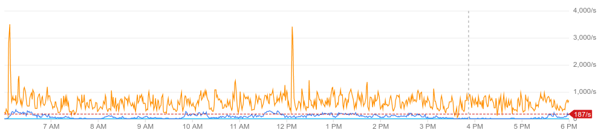

# May 30th, 2019 Prow Flakiness

Created by: [Katharine Berry](https://github.com/Katharine)

All times PDT.

## Summary

Increasing test load over time has lead to increased use of I/O resources by the k8s-prow-build
cluster. In the run-up to the Kubernetes 1.15 code freeze, a spike in usage lead to hitting hard
throttling limits, causing I/O operations to take so long that nodes experienced kernel panics
and test code wildly misbehaved.

## Impact

Many tests were failing in surprising ways, or being aborted partway through execution for no clear
reason. Artifacts were frequently not uploaded, causing Spyglass and Testgrid to be unable to see
that the job had ever finished running. The problem lasted for at least seven hours. Due to PRs
failing to merge as expected, 1.15 code freeze slipped a day.

Due to an unrelated monitoring failure, it is difficult to tell exactly what the problem first
became substantial. At peak, 60 PRs were stuck in the merge queue, and no PRs at all had merged for many hours.

## Root Cause

Prow jobs are run in a 100-node cluster. Each node has eight CPUs, 52 GB of RAM, and 250 GB of disk
space. On GCP, IOPS are limited proportionally to disk size. With our 250 GB disks, that gave us
187.5 IOPS per instance. While the majority of our nodes are not touching the disk at all most of
the time, nodes under certain workloads would spike up to large multiples of that:



The affected nodes suffered assorted failure modes, which ranged from pods failing, to kubelet
crashes, to kernel panics. While only a minority of nodes were affected at any given time, the
large number of pods that must successfully complete for a job to merge effectively brought us to
a standstill.

## Detection

Multiple users reported jobs that were reported to GitHub as having failed, but which upon
checking the job status actually appeared to still be running. This behaviour is caused by pods
exiting without successfully uploading `finished.json`, which most of our tooling uses to
determine job state.

Due to an unrelated failure, most prow/tide monitoring for the week leading to this incident is
permanently lost, making it difficult to establish how long the cluster was faulty. 

## Resolution

We requested and received quota for additional disk space and migrated the cluster to 500 GB disks
instead of 250 GB disks, with a corresponding increase in available IOPS. The cluster became
healthier once the migration was completed.

## Lessons Learned

### What went well

Not much.

### What went poorly

* Prow metrics were not being recorded in the runup to the incident, making it difficult to
 figure out what was going on.
* Alerting for these failures either does not exist or does not work.
* Once the cause had been determined and a fix devised, nothing was done for another two hours.
* The incident caused 1.15 code freeze to slip

### Where we got lucky

* Someone who realised that IOPS were the problem happened to be around to take a look.

## Action items

* Create and/or fix monitoring so that when tide stops doing things the oncall gets paged
  ([#12829](https://github.com/kubernetes/test-infra/issues/12829))
* Establish a process and guidelines for adding new members to the oncall rotation so they are not
  thrown in the deep end without any preparation or extra support.

## Timeline

* [???] IOPS reached a critical point such that cluster availability began degrading
* [13:26] @cblecker reports on Slack that something is wrong with Prow
* [14:11] @Katharine determines that many things are wrong with the Kubernetes nodes and the test pods
* [14:17] @BenTheElder loops in @Random-Liu
* [14:43] @Random-Liu determines the root cause is severe I/O throttling
* [15:02] The current oncaller is given directions on increasing capacity and requests additional disk quota
* [15:14] Additional disk quota is granted
* [17:10] @Katharine realises that capacity was not increased and brings up 55 nodes with 500 GB disks
* [17:41] @BenTheElder begins gradually migrating nodes to the 500GB node pool
* [23:55] @BenTheElder completes the migration to the new node pool, all nodes now have 500 GB disks
* [07:00] Prow is once again merging at its usual rate

## Appendinx

### #testing-ops chat log

>cblecker [1:26 PM]  
@test-infra-oncall there's something broken. I'm seeing failures being reported to GitHub, but Deck says jobs are still running. Seen this on a couple PRs now
>
>tony-yang [1:27 PM]  
Thanks, will take a look
>
>tony-yang [1:50 PM]  
@cblecker we don't see any significant red flag at the moment. Unfortunately, the job you provided is too old for us to obtain any useful information. It seems that there might be a transient issue with the job that uploads the finish state to Prow.  
If you have a more recent job that ended in similar state (within the last 15 min), we can take a look  
Thanks  
>
>cblecker [1:55 PM]  
@tony-yang sounds good. if I see it again, will let you know
>
>Katharine [1:57 PM]  
I can see a big burst of failures 1-3 hours ago  
Can't find anything more recent  
ooh I found one I think  
>    ```
>    State:          Terminated
>      Exit Code:    0
>      Started:      Mon, 01 Jan 0001 00:00:00 +0000
>      Finished:     Mon, 01 Jan 0001 00:00:00 +0000
>    ```
>what even is metadata (edited) 
>
>cblecker [2:07 PM]  
haha.. well that explains why Deck is all ¯\\\_(ツ)\_/¯
>
>Katharine [2:11 PM]  
upon further investigation, there are a bunch of pods and nodes in very questionable states  
Kubernetes is happening  
And it looks like pods are being evicted by something that is not us  
>
>cblecker [2:12 PM]  
oh that's always fun
>
>Katharine [2:13 PM]  
Also not super convinced that this one job pod I see that it has tried to kill 2,420 times over the last four days is doing what it's supposed to.  
>
>Katharine [2:46 PM]  
everything is on fiiiiire  
:fire:  
(we've managed to exhaust our IOPS quota... by a factor of two.)  
stuff should probably still be mostly working actually.  
but flakes abound
>
>tony-yang [2:47 PM]  
We noticed that we have used 2x disk IO, which caused the slow down we were experiencing earlier. We are actively working to on an upgrade plan and will notify the community when we will start the maintenance. Thanks
>
>cblecker [3:34 PM]  
Thank you both :pray:
>
>alejandrox1 [4:04 PM]  
hi all, is tide working?  
i’ve seen a couple prs that have been lgtm’d, approved, and all tests passed (even part of the v1.15 milestone) and they haven’t been merged in 12+ hrs
>
>liggitt [4:05 PM]  
Last merge was 5 hours ago. https://github.com/kubernetes/kubernetes/commits/master  
The queue is long
>
>liggitt [4:05 PM]  
https://prow.k8s.io/tide
>
>liggitt [4:05 PM]  
and CI has been very red, which means it drains slowly
>
>cjwagner [4:09 PM]  
Yeah AFAICT Tide is working properly, the problem is that the nodes are on fire. See the batch jobs: https://prow.k8s.io/?repo=kubernetes%2Fkubernetes&type=batch
>
>cblecker [5:07 PM]  
@tony-yang @Katharine can I get an update on the health of things? It looks still very unhealthy from the outside
>
>Katharine [5:07 PM]  
things are worse, tony disappeared somewhere, I'm working on it now
>
>cblecker [5:08 PM]  
okay thank you. good luck. let me know if there is anything help a non-googler can provide
>
>Katharine [5:10 PM]  
I'm bringing up 80 nodes with more disk space, which is what I can pull off given our quota headroom. hopefully this alleviates our current issue
>
>cjwagner [5:13 PM]  
Anything I can do to help Katharine? Is bumping disk capacity our only mitigation?
>
>Katharine [5:14 PM]  
It looks like most/all of our problems basically come back to I/O calls variously failing or being slow enough to look like they failed  
more disk capacity and, really, the associated I/O capacity should bring us back below GCP aggressively throttling us  
(Additionally we'll have almost twice as many nodes until we clean up, so that probably also helps)
>
>cjwagner [5:15 PM]  
We could set a global `max_concurrency` for plank to throttle the overall job load on the cluster.
>
>Katharine [5:17 PM]  
and by 80 I mean 55 because I forgot what the original quota request we made was for  
anyway, 55 now, then I'll start shifting over capacity from the existing nodepool until we get back up to 100  
(so we'll have 155 nodes in the interim)  
new nodes appear to be up
>
>cjwagner [5:19 PM]  
Cool. Lets hold off on a global throttle then and see if the additional nodes are sufficient.  
Oh, sweet. That was fast. (edited) 
>
>liggitt [5:20 PM]  
sometimes the cloud is cool
>
>cblecker [5:20 PM]  
don't lie. computers are awful.
>
>Katharine [5:21 PM]  
jobs are now being scheduled to them
>
>liggitt [5:21 PM]  
"I do exactly what you tell me to. You told me to burn my CPUs into a slag heap repeatedly running CI jobs. Yes sir!"
>
>Katharine [5:21 PM]  
I'll be back shortly  
for now, working theory is that the extra 55 nodes should reduce pressure such that everything returns to normal shortly without needing to actually migrate capacity to the new nodepool so we'll probably just leave it like this for a bit unless behaviour fails to improve
>
>tony-yang [5:26 PM]  
Thanks Katharine for helping out
>
>liggitt [5:28 PM]  
>>liggitt [5:26 PM]
shoutout to the #testing-ops folks who cheerfully keep our *insane* CI load moving forward during code freeze crunches  
Posted in #shoutouts
>
>bentheelder [5:39 PM]  
joined #testing-ops.
>
>bentheelder [5:41 PM]  
I'm migrating some capacity from the smaller-disk node pool to the bigger one. (draining the old nodes -> increasing the new pool), will be a lot slower but we'll start to standardize on the bigger disks.
>
>Thankfully most of the time we're already doing _okay_ on I/O for the lower capacity, but not with consistently comfortable enough overhead...  
This _should_ resolve a number of intermittent unexplained issues. Thanks @random-liu for root-causing this :slightly_smiling_face:
>
>Katharine [7:04 PM]  
  
>
>it looks like this did get a lot worse over the last day or two.  
(I like how that doesn't have a key. green is throttled writes, red is throttled reads.)
>
>liggitt [7:14 PM]  
is most of that on the scale jobs?  
or do we have any way to slice by job
>
>Katharine [8:08 PM]  
@liggitt I don't think we have any easy way to slice that by job - our best is probably nodes and times (edited) 
>
>cblecker [8:09 PM]  
The 5k node job is still pretty unhealthy: https://prow.k8s.io/?repo=kubernetes%2Fkubernetes&job=pull-kubernetes-kubemark-e2e-gce-big
>
>Katharine [8:10 PM]  
That is should only be counting the build cluster though, so unless the scale jobs are doing consistently high writes in that build for hours, it seems unlikely to me that it's the sole cause.  
Hm
>
>cblecker [8:11 PM]  
the ones that are showing as "pending" don't appear to be running if you look at some the logs  
and I think it's hit max concurrency as all the newer jobs are just sitting in triggers/aborted
>
>Katharine [8:14 PM]  
max_concurrency on that job is 12  
there are 12 running.  
so it's not sad, just behaving as expected  
the oldest running one started an hour ago and it takes 1-3 hours (edited)   
so none of this seems unusual  
at the earliest the current backlog on that job cannot be cleared for another probably six or seven hours  
>
>cblecker [8:17 PM]  
hmm.. I must have clicked the wrong link or something because I swear I saw logs that show it finished but was still in a pending state.. but I don't see it now (things look just as you say)  
thanks for checking
>
>bentheelder [11:55 PM]  
done migrating. we've standardized on the bigger disks now  

### GKE EngProd Chat Log

>Benjamin Elder [2:17 PM]  
>FYI poking node team about k8s-prow-builds issues, we have some unhappy nodes in the containerd pool. Looks like kubelet <-> CRI RPC issues (?)  
@Katharine Berry is also looking, we have pods that aren't being killed successfully and lots of testgrid entries with partial uploads. Getting spurious testgrid flake alerts due to jobs not uploading.
>
>Benjamin Elder [2:22 PM]  
>Lantao is looking at these two:
>```
>gke-prow-containerd-pool-99179761-02q6   NotReady   <none>   14d     v1.13.5-gke.10
>gke-prow-containerd-pool-99179761-313j   NotReady   <none>   14d     v1.13.5-gke.10
>```
>sounds like there's some kind of deadlock deleting pods sometimes  
@Tony Yang
>
>Cole Wagner [2:37 PM]  
The set of nodes in the NotReady state is changing.
>```
>$ kg nodes | grep -v "\bReady\b"
>NAME                                     STATUS     ROLES    AGE     VERSION
>gke-prow-containerd-pool-99179761-02q6   NotReady   <none>   14d     v1.13.5-gke.10
>gke-prow-containerd-pool-99179761-4377   NotReady   <none>   14d     v1.13.5-gke.10
>gke-prow-containerd-pool-99179761-t05g   NotReady   <none>   13d     v1.13.5-gke.10
>$ kg nodes | grep -v "\bReady\b"
>Cluster: gke_k8s-prow-builds_us-central1-f_prow
>NAME                                     STATUS     ROLES    AGE     VERSION
>gke-prow-containerd-pool-99179761-02q6   NotReady   <none>   14d     v1.13.5-gke.10
>gke-prow-containerd-pool-99179761-s4k7   NotReady   <none>   162d    v1.13.5-gke.10
>```
>
>Benjamin Elder [2:37 PM]  
yeah, talking to lantao offfline, TLDR:
>- we're seeing kernel panics (yay!)
>- we're getting absurd I/O throttling because we do too much disk I/O and GCE is throttling us (glares at bazel)
>- probably we can increase the disk sizes to avoid this
>
>Benjamin Elder [2:43 PM]  
Estimated performance  
Operation type	Read	Write  
Sustained random IOPS limit	187.50	375.00  
Sustained throughput limit (MB/s)	30.00	30.00  
whereas we're actually hitting 80MB/s and > 450 IOPS when we're getting throttled
>
>Katharine Berry [2:47 PM]  
other weirdness: pods that have been in the PodInitializing state for half an hour, kubelets that are in reboot loops
>
>Benjamin Elder [3:02 PM]  
@Tony Yang https://github.com/kubernetes/test-infra/blob/master/experiment/maintenance/shift_nodepool_capacity.py
>
>Sen Lu [3:10 PM]  
sounds like this gonna be one of those very exciting oncall rotation
>
>Benjamin Elder [3:11 PM]  
probably not, this issue has been going on for a long time  
this is what was previously written off as COS / containerd issues but is actually us using ridiculously high amounts of I/O vs our capacity.  
it sounds like some of the other prows have this issue too
>
>Sen Lu [3:14 PM]  
yes we've been making larger nodes for another prow as well  
didn't know it's hitting k8s-prow as well
>
>Benjamin Elder [9:03 PM]  
Katharine span up 55 nodes in a pool with 2x (500GB) disks, I'm waiting on the migrate script to move over the rest of the capacity still, we've crossed the majority of nodes being the 500GB type.  
more in #testing-ops on slack
>
>Katharine Berry [9:03 PM]  
Looking at prow, it looks good at a glance  
We should probably work on a postmortem tomorrow  
Especially given this caused code freeze to slip  
>
>Benjamin Elder [11:55 PM]  
migrating capacity is done