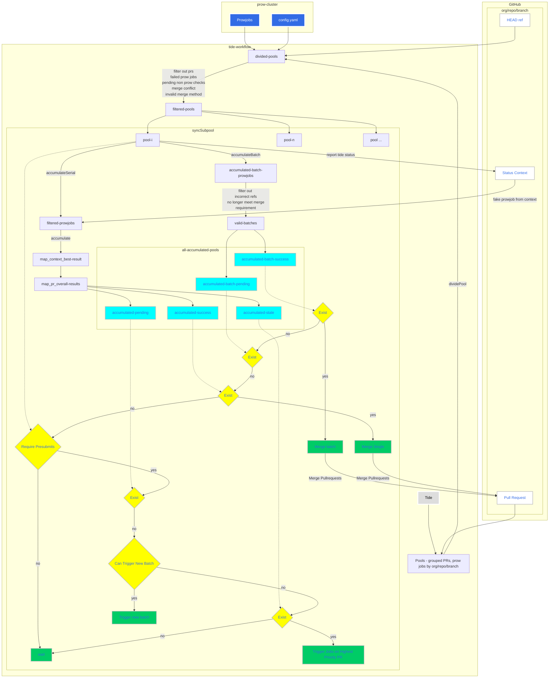

# Tide

Tide is a [Prow](https://github.com/kubernetes/test-infra/blob/master/prow/README.md)
component for managing a pool of GitHub PRs that match a given set of criteria.
It will automatically retest PRs that meet the criteria ("tide comes in") and automatically merge
them when they have up-to-date passing test results ("tide goes out").

[Open Issues](https://github.com/kubernetes/test-infra/issues?utf8=%E2%9C%93&q=is%3Aopen+is%3Aissue+label%3Aarea%2Fprow%2Ftide)

## Documentation
- [I JUST WANT MY PR TO MERGE!](/prow/cmd/tide/pr-authors.md)
- [Configuring Tide](/prow/cmd/tide/config.md)
- [Maintainer's Guide](/prow/cmd/tide/maintainers.md)

## Features
- Automatically runs batch tests and merges multiple PRs together whenever possible.
- Ensures that PRs are tested against the most recent base branch commit before they are allowed to merge.
- Maintains a GitHub status context that indicates if each PR is in a pool or what requirements are missing.
- Supports blocking merge to individual branches or whole repos using specifically labelled GitHub issues.
- Exposes Prometheus metrics.
- Supports repos that have 'optional' status contexts that shouldn't be required for merge.
- Serves live data about current pools and a history of actions which can be consumed by [Deck](/prow/cmd/deck) to populate the [Tide dashboard](https://prow.k8s.io/tide), the [PR dashboard](https://prow.k8s.io/pr), and the [Tide history page](https://prow.k8s.io/tide-history).
- Scales efficiently so that a single instance with a single bot token can provide merge automation to dozens of orgs and repos with unique merge criteria. Every distinct 'org/repo:branch' combination defines a disjoint merge pool so that merges only affect other PRs in the same branch.
- Provides configurable merge modes ('merge', 'squash', or 'rebase').

## History

Tide was created in 2017 by @spxtr to replace `mungegithub`'s Submit Queue.  It was designed to manage a large number of repositories across organizations without using many API rate limit tokens by identifying mergeable PRs with GitHub search queries fulfilled by GitHub's v4 GraphQL API.

## Flowchart

