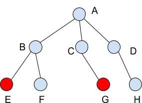
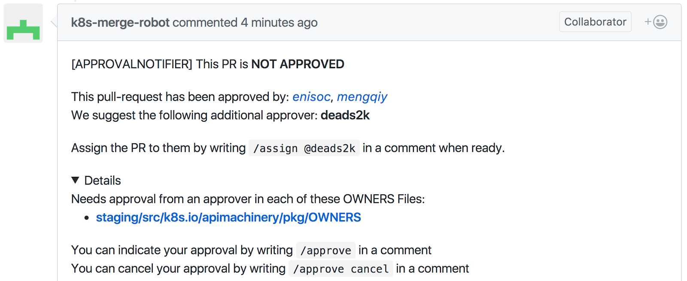

# Reviewers and Approvers

## Questions this Doc Seeks To Answer

1. What do we need to get a PR merged into kubernetes/kubernetes?
2. What are reviewers, approvers, and the OWNERS files?
3. How does the reviewer selection mechanism work? approver selection mechanism work?
4. How does an approver know which PR s/he has to approve?

## Overview

Every GitHub directory which is a unit of independent code contains a file named "OWNERS". The file lists reviewers and approvers for the directory. Approvers (or previously called assignees) are owners of the codes. 

Approvers:
* have contributed substantially to the repo
* can provide a final approval (`/approve`) indicating whether a change to a directory or subdirectory should be accepted
* Approval is done on a per directory basis and subdirectories inherit their parents directory's approvers

Reviewers:
* generally a larger set of current and past contributors
* They are responsible for a more thorough code review, discussing the implementation details and style
* Provide an `/lgtm` when they are satisfied with the Pull Request 

An example of the OWNERS file is listed below:

reviewers:
* jack
* ken
* lina

approvers:
* jack
* ken
* lina

Note that items in the OWNERS files can be GitHub usernames, or aliases defined in OWNERS_ALIASES files. An OWNERS_ALIASES file is another co-existed file that delivers a mechanism for defining groups. However, GitHub Team names are not supported. We do not use them because there is no audit log for changes to the GitHub Teams. This way we have an audit log.

## Blunderbuss And Reviewers

### lgtm Label

LGTM is abbreviation for "look good to me". The **lgtm** label is normally given when the code has been thoroughly reviewed.  Getting it means the PR is one step away from getting merged.  Reviewers of the PR give the label to a PR by typing /lgtm in a comment, or retract it by typing /lgtm cancel. Authors of the PR cannot give the label, but they can cancel it. The bot retracts the label automatically if someone updates the PR with a new commit.

### Blunderbuss Selection Mechanism

Blunderbuss provides statistical means to select a subset of approvers found in OWNERS files for approving a PR. A PR consists of changes on one or more files, in which each file has different number of lines of codes changed. Blunderbuss determines the magnitude of code change within a PR using total number of lines of codes changed across various files. Number of reviewers selected for each PR is 2.

Algorithm for selecting reviewers is as follows:

(1) determine potential reviewers of a file by going over all reviewers found in the OWNERS files for current and parent directories of the file (deduplication involved)

(2) assign each changed file with a weightage based on number of lines of codes changed

(3) assign each potential reviewer with a weightage by summing up weightages of all changed files in which s/he is a reviewer

(4) randomly select 2 reviewers based on their weightage

## Approval Handler and the Approved Label

### approved Label

A PR cannot be merged into the Kubernetes repo without the **approved** label.  In order for the approved label to be applied, every file modified by the PR must be approved (via /approve) by an approver from the OWNERs files.  Note, this does not necessarily require multiple approvers.  The process is best illustrated in the example below.

**Approval Selection Mechanism**

First, it is important to understand that ALL approvers in an OWNERS file can approve any file in that directory AND its subdirectories. Second, it is important to understand the somewhat-competing goals of the bot when selecting approvers:

1. Provide a subset of approvers that can approve all files in the PR

2. Provide a small subset of approvers and suggest the same reviewers as blunderbuss if possible (people can be both reviewers and approvers)

3. Do not always suggest the same set of people to approver and do not consistently suggest people from the root OWNERS file

The exact algorithm for selecting approvers is somewhat complex; it is an set cover approximation with consideration for existing assignees. To read it in depth, check out the approvers source code linked at the end of the README.  

**Example**

Suppose files in directories E and G are changed in a PR created by PRAuthor. Any combination of approver(s) listed below can approve the PR in order to get it merged:

(1) approvers found in OWNERS files for leaf (current) directories E and G

(2) approvers found in OWNERS files for parent directories B and C

(3) approvers found in OWNERS files for root directory A

Note someone can be both a reviewer found in OWNERS files for directory A and E. If s/he is selected as an approver and gives approval, it approves entire PR because s/he is also a reviewer for the root directory A.

**Step 1:**

K8s-bot creates a comment that suggests the selected approvers and shows a list of OWNERS file(s) where the approvers can be found.
	
	[APPROVALNOTIFIER] This PR is **NOT APPROVED**

	This pull-request has been approved by: *PRAuthor*
	We suggest the following additional approvers: **approver1,** **approver2**

	If they are not already assigned, you can assign the PR to them by writing `/assign @approver1 @approver2` in a comment when ready.

	∇ Details
	Needs approval from an approver in each of these OWNERS Files:
	* /A/B/E/OWNERS
	* /A/B/G/OWNERS

	You can indicate your approval by writing `/approve` in a comment
	You can cancel your approval by writing `/approve cancel` in a comment

A selected approver such as *approver1* can be notified by typing `/assign @approver1` in a comment.

**Step 2:**

**Case (a)**: *approver1* is in the E OWNERS file. S/he writes `/approve`

K8s-bot updates comment:
	
	[APPROVALNOTIFIER] This PR is **NOT APPROVED**

	This pull-request has been approved by: *approver1, PRAuthor*
	We suggest the following additional approver: **approver2**

	If they are not already assigned, you can assign the PR to them by writing /assign @approver2 in a comment when ready.

	∇ Details
	Needs approval from an approver in each of these OWNERS Files:
	~* /A/B/E/OWNERS~ [approver1]
	* /A/B/G/OWNERS

	You can indicate your approval by writing `/approve` in a comment
	You can cancel your approval by writing `/approve cancel` in a comment

**Case (b)**: *approver3* is NOT an approver of the PR. S/he writes `/approve`

K8s-bot updates comment:
	
	[APPROVALNOTIFIER] This PR is **NOT APPROVED**

	This pull-request has been approved by:* approver3, PRAuthor* 
	We suggest the following additional approvers: **approver1,** **approver2**

	If they are not already assigned, you can assign the PR to them by writing /assign @approver1 @approver2 in a comment when ready.
	
	∇ Details
	Needs approval from an approver in each of these OWNERS Files:
	* /A/B/E/OWNERS
	* /A/B/G/OWNERS

	You can indicate your approval by writing `/approve` in a comment
	You can cancel your approval by writing `/approve cancel` in a comment

**Case (c)**: *approver1* is an approver of the PR. S/he writes `/lgtm`

K8s-bot updates comment:
	
	[APPROVALNOTIFIER] This PR is **NOT APPROVED**

	This pull-request has been approved by: *approver1, PRAuthor*
	We suggest the following additional approver: **approver2**

	If they are not already assigned, you can assign the PR to them by writing /assign @approver2 in a comment when ready.
	
	∇ Details
	Needs approval from an approver in each of these OWNERS Files:
	* ~/A/B/E/OWNERS~ [approver1]
	* /A/B/G/OWNERS

	You can indicate your approval by writing `/approve` in a comment
	You can cancel your approval by writing `/approve cancel` in a comment

The **lgtm** label is immediately added to the PR.

**Step 3**: *approver2* writes `/approve`

K8s-bot updates comment:
	
	[APPROVALNOTIFIER] This PR is** APPROVED**

	The following people have approved this PR:* approver1**, **approver2, PRAuthor*

	∇ Details
	Needs approval from an approver in each of these OWNERS Files:
	* ~/A/B/E/OWNERS~ [approver1]
	* ~/A/B/G/OWNERS~ [approver2]

	You can indicate your approval by writing `/approve` in a comment
	You can cancel your approval by writing `/approve cancel` in a comment

K8s-bot merges the PR. It needs to wait its turn in submit queue and passes tests.

**Final Notes**

Obtaining approvals from selected approvers is the last step towards merging a PR. The approvers approve a PR by typing `/approve` in a comment, or retract it by typing `/approve` cancel. 

Algorithm for getting the status is as follow:

(1) run through all comments after newest commit to obtain latest intention of approvers

(2) put all approvers into an approver set

(3) determine whether a file has at least one approver in the approver set

(4) add the status to the PR if all files have been approved

If an approval is cancelled, the bot will delete the status added to the PR and remove the approver from the approver set. If someone who is not an approver in the OWNERS file types `/approve` in a comment, the PR will not be approved. If someone who is an approver in the OWNERS file and s/he does not get selected, s/he can still type `/approve` or `/lgtm` in a comment, pushing the PR forward.

**Code Implementation Links**

Blunderbuss: 
[prow/plugins/blunderbuss/blunderbuss.go](https://git.k8s.io/test-infra/prow/plugins/blunderbuss/blunderbuss.go)

LGTM:
[prow/plugins/lgtm/lgtm.go](https://git.k8s.io/test-infra/prow/plugins/lgtm/lgtm.go)

Approve:
[prow/plugins/approve/approve.go](https://git.k8s.io/test-infra/prow/plugins/approve/approve.go)

[prow/plugins/approve/approvers/owners.go](https://git.k8s.io/test-infra/prow/plugins/approve/approvers/owners.go)

