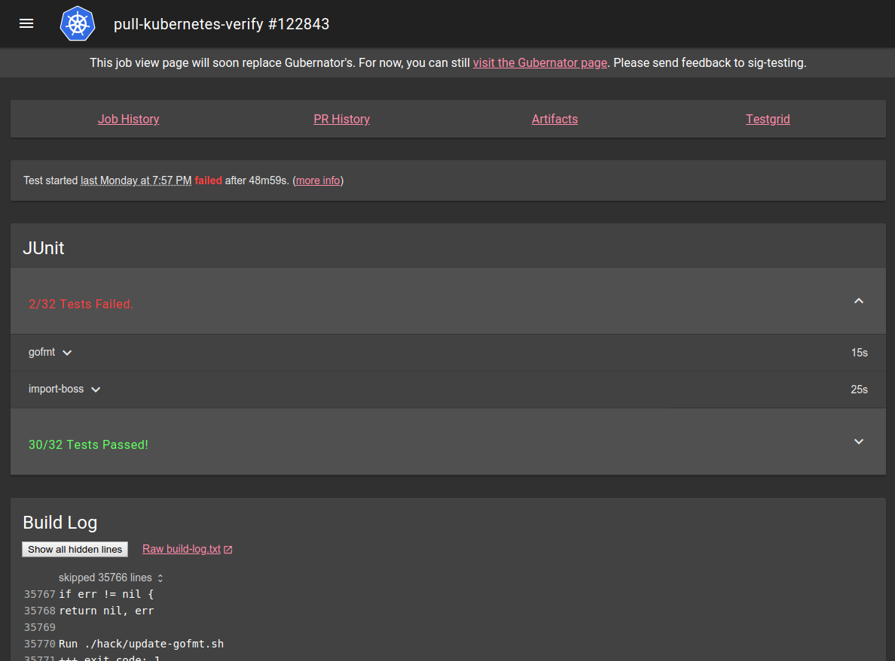

# Spyglass

Spyglass is a pluggable artifact viewer framework for [Prow](..). It collects artifacts
(usually files in a storage bucket) from various sources and distributes them to registered viewers, which
are responsible for consuming them and rendering a view.

A typical Spyglass page might look something like this:


If you want to know how to write a Spyglass lens, check [the lens-writing guide](./write-a-lens.md).
If you're interested in how Spyglass works, check [the architecture summary](./architecture.md).

## Configuration

Using Spyglass on your Prow instance requires you to first enable Spyglass in `deck`, and then
configure Spyglass to actually do something.

### Enabling Spyglass

To enable spyglass, just pass the `--spyglass` flag to your `deck` instance. Once spyglass is enabled,
it will expose itself under `/view/` on your `deck` instance.

In order to make Spyglass useful, you may want to set your job URLs to point at it. You can do so by
setting `plank.job_url_prefix_config['*']` to `https://your.deck/view/gs/`, and possibly `plank.job_url_template`
to reference something similar depending on your setup.

If you are not using the images we provide, you may also need to provide `--spyglass-files-location`,
pointing at the on-disk location of the `lenses` folder in this directory.

### Configuring Spyglass

Spyglass configuration is contained in the `spyglass` subsection of the `deck` section of Prow's
primary configuration.

The `spyglass` block has the following properties:

| Name | Required | Example | Description |
|---|---|---|---|
| `size_limit` | Yes | `100000000` | The maximum size of an artifact to download, in bytes. Larger values will be omitted or truncated. |
| `gcs_browser_prefix` | No | `https://gcsweb.k8s.io/gcs/` | If you have a GCS browser available, the bucket and path to the artifact directory will be appended to `gcs_browser_prefix` and linked from Spyglass pages. If left unset, no artifacts link will be visible. The provided URL should have a trailing slash |
| `testgrid_config` | No | `gs://k8s-testgrid/config` | If you have a TestGrid instance available, `testgrid_config` should point to the TestGrid config proto on GCS. If omitted, no TestGrid link will be visible.
| `testgrid_root` | No | `https://testgrid.k8s.io/` | If you have a TestGrid instance available, `testgrid_root` should point to the root of the TestGrid web interface. If omitted, no TestGrid link will be visible.
| `announcement` | No | `"Remember: friendship is magic!"` | If announcement is set, the string will appear at the top of the page. `announcement` is parsed as a Go template. The only value provided is `.ArtifactPath`, which is of the form `gcs-bucket/path/to/job/root/`.
| `lenses` | Yes | (see below) | `lenses` configures the lenses you want, when they should be visible, what artifacts they should receive, and

#### Configuring Lenses

Lenses are the Spyglass components that actually display information. The `lenses` block under the
`spyglass` block is a list of configuration for each lens. Each lens entry has the following
properties:

| Name | Required | Example | Description |
|---|---|---|---|
| `required_files` | Yes | `- build-log\.txt` | A list of regexes matching artifact names that _must_ be present for a lens to appear. The list entries are ANDed together - that is, something much match every entry. OR can be simulated by using a pipe in a single regex entry.
| `optional_files` | No | `- something\.txt` | A list of regexes matching artifact names that will be provided to a lens if present, but are not necessary for it to appear (for that, use `required_files`). Since each entry in the list is optional, these are effectively ORed together.
| `lens.name` | Yes | `buildlog` | The name of the lens you want to render these files. Must be a known lens name.
| `lens.config` | No | | Lens-specific configuration. What can be included here, if anything, depends on the lens in question.

The following lenses are available:

- `metadata`: parses the metadata files generated by [podutils](https://github.com/kubernetes/test-infra/blob/master/prow/pod-utilities.md)
  and displays their content. It has no configuration.
- `junit`: parses junit files and displays their content. It has no configuration
- `buildlog`: displays the build log (or any other log file), highlighting interesting parts and
  hiding the rest behind expandable folders. You can configure what it considers "interesting" by
  providing `highlight_regexes`, a list of regexes to highlight. If not specified, it uses [defaults
  optimised for highlighting Kubernetes test results](https://github.com/kubernetes/test-infra/blob/370da51e0f051504be2e97305e8536ab06b3f0df/prow/spyglass/lenses/buildlog/lens.go#L76). The optional `hide_raw_log` boolean field can be used to omit the link to the raw `build-log.txt` source.
- `podinfo`: displays info about ProwJob pods including the events and details about containers and volumes. The [`gcsk8sreporter` Crier reporter](https://github.com/kubernetes/test-infra/tree/b6180c95b3383919711cfc97436a2d082281d284/prow/crier/reporters/gcs/kubernetes) must be enabled to upload the required `podinfo.json` file.
- `coverage`: displays go coverage content
- `restcoverage`: displays REST API statistics

#### Example Configuration

```yaml
deck:
  spyglass:
    size_limit: 100000000  # 100 MB
    gcs_browser_prefix: https://gcsweb.k8s.io/gcs/
    testgrid_config: gs://k8s-testgrid/config
    testgrid_root: https://testgrid.k8s.io/
    announcement: "The old job viewer has been deprecated."
    lenses:
    - lens:
        name: metadata
      required_files:
      - ^(?:started|finished)\.json$
      optional_files:
      - ^(?:podinfo|prowjob)\.json$
    - lens:
        name: buildlog
        config:
          highlight_regexes:
          - timed out
          - 'ERROR:'
          - (FAIL|Failure \[)\b
          - panic\b
          - ^E\d{4} \d\d:\d\d:\d\d\.\d\d\d]
      required_files:
      - ^build-log\.txt$
    - lens:
        name: junit
      required_files:
      - ^artifacts/junit.*\.xml$
    - lens:
        name: podinfo
      required_files:
        - ^podinfo\.json$
```

### Accessing custom storage buckets

By default, spyglass has access to all storage buckets defined globally
(`plank.default_decoration_configs[...].gcs_configuration`) or on individual jobs (`<path-to-job>.gcs_configuration.bucket`).
In order to access additional/custom storage buckets, those buckets must be listed in `deck.additional_storage_buckets`.
